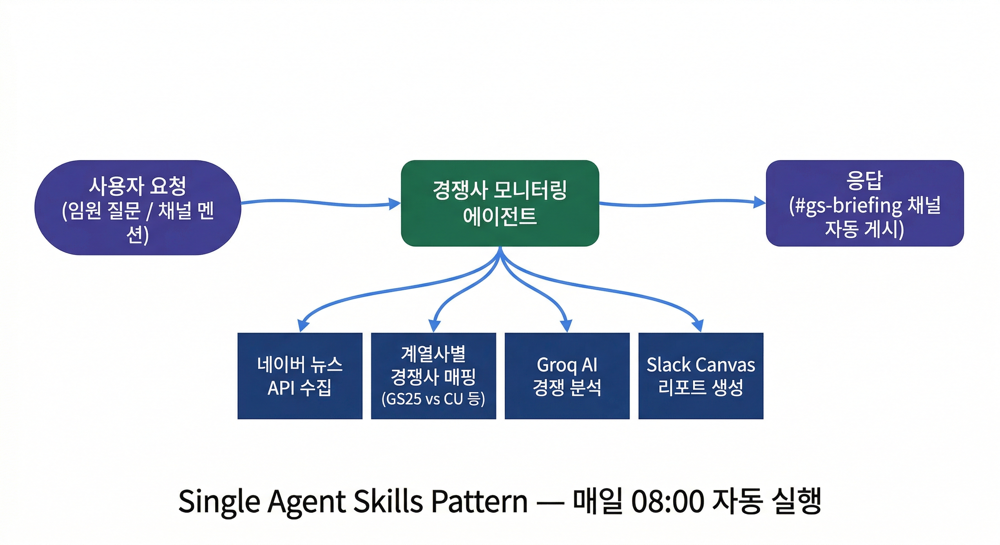
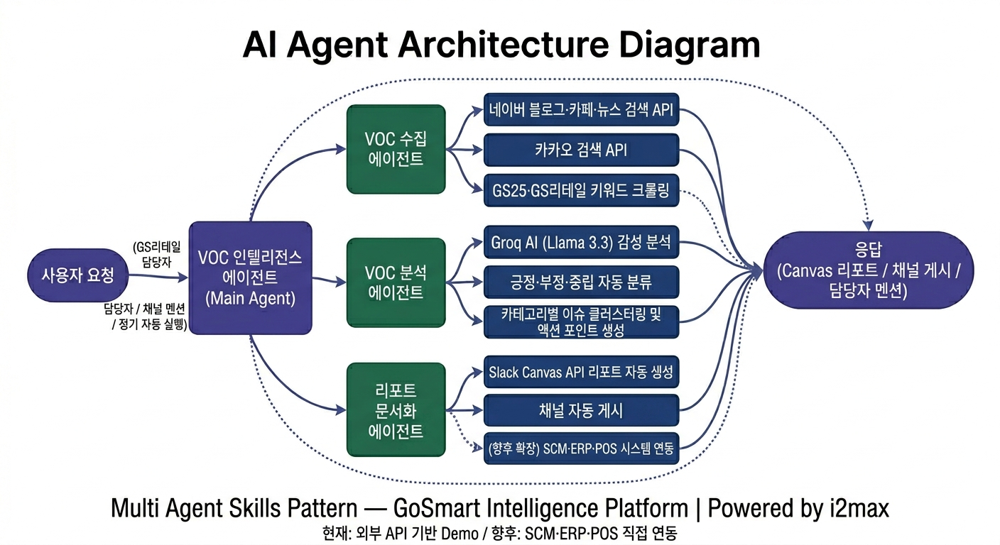
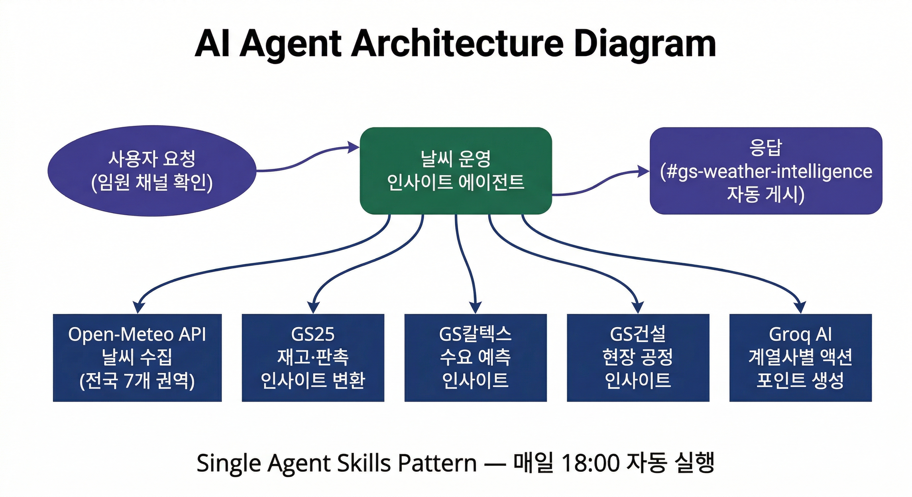

# Case 14. GS AI Intelligence Apps

**시장·경쟁사·고객 정보를 업무에서 검토할 수 있는 앱으로 구현한 사례**

GS 프로젝트에서 경쟁사 뉴스와 고객 반응, 날씨와 에너지 시장 정보를 다루는 AI 앱을 기획하고 프로토타입을 제작했습니다. 필요한 정보를 정한 뒤 외부 데이터 수집, AI 분석, Slack 보고서와 알림으로 이어지는 사용 흐름을 설계했습니다.

**수행 범위:** 업무 시나리오·정보 흐름 기획, AI-assisted 앱·프로토타입 제작, 데모 준비 및 온보딩 지원

**사례 단계:** 데모·프로토타입과 후속 확장 설계

**자료 기준:** 2026-10-08 본인이 제공한 앱 아키텍처 원본 11장과 프로젝트 수행 기록

## 업무에서 확인하려던 정보

| 업무 과제 | 기획한 앱 | 전달할 내용 |
|---|---|---|
| 경쟁사의 움직임을 주기적으로 살피기 | 경쟁사 뉴스 모니터링 | 계열사별 경쟁사 뉴스와 분석 보고서 |
| 공개된 고객 반응에서 주요 이슈 찾기 | 고객 VOC 인텔리전스 | 감성 분류, 유사 이슈 묶음, 검토할 대응 사항 |
| 날씨 정보를 유통·현장 운영과 함께 보기 | 날씨 운영 인사이트 | 재고·판촉·수요·공정에 관한 검토 사항 |
| 에너지 시장 변화의 영향을 살피기 | 에너지 인텔리전스·AI 어시스턴트 | 가격·환율 정보, 계열사별 영향 검토와 질의응답 |
| 사업장 방문에 필요한 정보를 전달하기 | 사업장 이동시간 조회 | 경로별 이동시간·혼잡도와 정기 안내 |

## 내가 맡은 일과 AI 활용

프로젝트에서 다룰 업무와 사용자가 확인할 정보를 정하고, 정보를 수집한 뒤 분석·보고하는 흐름을 앱과 프로토타입으로 만들었습니다. AI 코딩 도구를 활용한 제작 과정에서는 기능과 화면 구성을 정하고 구현 결과를 검토했습니다. 고객에게 설명할 데모와 임원 대상 온보딩도 준비·지원했습니다.

조사·요구사항 정리에는 ChatGPT와 Claude를 활용했습니다. 앱 내부에서는 Groq 기반 Llama 모델을 경쟁 분석·VOC 분류·업무별 시사점 생성에 적용했고, 에너지 AI 어시스턴트에는 Claude API를 사용하는 구조를 구성했습니다. 아래 자료는 이들 앱의 데이터 소스와 분석·전달 방식을 보여줍니다.

## 1. 경쟁사 뉴스 모니터링

계열사별로 비교할 경쟁사를 정하고 네이버 뉴스 API로 관련 뉴스를 수집하는 흐름을 구성했습니다. 유통 분야에서는 GS25와 CU·세븐일레븐, GS리테일과 이마트·롯데마트 등 비교 대상을 나누고 Groq 기반 분석 결과를 Slack 채널과 Canvas 보고서로 전달하도록 했습니다.

조사 대상과 전달할 정보를 먼저 정한 뒤 수집·분석·공유를 하나의 사용 흐름으로 만든 사례입니다. 원본의 파일명에 ‘공시앱’이라는 표현이 있지만, 이 자료에서 확인되는 데이터 소스는 뉴스 API이므로 여기서는 뉴스 모니터링으로 설명합니다.

[데이터 소스와 계열사별 경쟁 구분을 담은 서비스 구조 원본](../assets/gs-ai-prototypes/competitor-service.png)

## 2. 고객 VOC 인텔리전스

네이버·카카오의 공개 검색 자료에서 GS25·GS리테일 관련 고객 반응을 수집하고, 긍정·부정·중립으로 분류하는 데모를 구성했습니다. 유사 이슈를 묶고 검토할 대응 사항을 정리한 뒤 Slack Canvas 보고서와 채널 게시로 전달하는 흐름입니다.

수집·분석·문서화의 역할을 나누어 고객 반응이 어떤 경로로 보고 자료가 되는지 설명했습니다. 데모는 외부 API를 사용하며 내부 SCM·ERP·POS 연결은 후속 확장안입니다.

[API·분석 모델·Slack 구성을 담은 서비스 구조 원본](../assets/gs-ai-prototypes/voc-service-demo.png)

## 3. 날씨 운영 인사이트

Open-Meteo API의 전국 7개 권역 날씨 정보를 계열사 업무에 맞는 검토 사항으로 바꾸는 앱을 기획했습니다. 유통 부문에서는 GS25의 재고·판촉, 에너지 부문에서는 수요, 건설 부문에서는 현장 공정과 관련해 살펴볼 사항을 생성하는 구조입니다.

날씨 정보를 전달하는 것에 더해 담당자가 무엇을 검토할지 함께 제안하도록 설계했습니다. 이는 운영 시사점과 대응안을 제시하는 프로토타입이며 실제 판매·재고 자료로 검증한 수요 예측 성과를 뜻하지 않습니다.

[날씨 데이터 소스와 분석·전달 구조 원본](../assets/gs-ai-prototypes/weather-service.png)

## 함께 기획한 앱

| 앱 | 원본에서 설명하는 기능 | 구조도 |
|---|---|---|
| 에너지 인텔리전스 | 원유·가스·탄소배출권 가격과 환율 정보를 수집하고 계열사별 영향·위험 검토와 보고서 생성 | [구조도](../assets/gs-ai-prototypes/energy-market-agent.png) |
| 에너지 AI 어시스턴트 | 축적된 채널 보고서와 대화 맥락을 바탕으로 질문에 답하고 Canvas 문서 생성 | [에이전트 구조](../assets/gs-ai-prototypes/energy-assistant-agent.png) · [서비스 구조](../assets/gs-ai-prototypes/energy-assistant-service.png) |
| 사업장 이동시간 조회 | 교통 API로 사업장 간 경로와 이동시간을 조회하고 혼잡도를 구분해 전달 | [구조도](../assets/gs-ai-prototypes/site-travel-agent.png) |

## 결과물과 사업 기획에서의 의미

외부 정보가 수집되고 AI 분석을 거쳐 보고서·알림으로 전달되는 흐름을 앱과 프로토타입으로 만들었습니다. 필요한 데이터, 분석 역할, 사용자가 받는 결과물을 함께 정하면서 고객에게 설명할 데모와 서비스 구조 자료를 마련했습니다.

시장·경쟁사 조사와 고객 동향 분석을 반복 가능한 업무로 설계하고, 새로운 AI 서비스의 대상 업무와 기능 범위를 정한 경험입니다. 이 사례의 결과물은 앱·프로토타입과 설계 자료이며 매출 증가나 정량적인 의사결정 개선 성과를 주장하지 않습니다.

## 데모와 확장 설계의 구분

- **현재 사례:** 외부 뉴스·공개 검색·날씨 등의 API를 활용하는 앱·프로토타입. 가상 데이터를 사용한 별도의 사업부 대시보드와 구분합니다.
- **후속 설계:** 내부 SCM·ERP·POS·CRM 연동, 분석 결과의 부서 배정, 기업 환경에 따른 AI 모델 선택. [Enterprise 확장 구조](../assets/gs-ai-prototypes/enterprise-extension-design.png)는 이 방향을 설명합니다.
- **운영 표기:** 원본에 적힌 실행 주기와 배포 구성은 아키텍처 설명입니다. 그림만으로 실제 전사 배포, 임원 사용률, 가동률 또는 운영 효과가 입증되지는 않습니다.

[원본 이미지 11장 안내](../assets/gs-ai-prototypes/README.md) · [AI Solution & AX](../tracks/ai-solution-and-ax.md) · [AI-assisted Delivery](../tracks/ai-assisted-delivery.md) · [전체 포트폴리오](../README.md)
