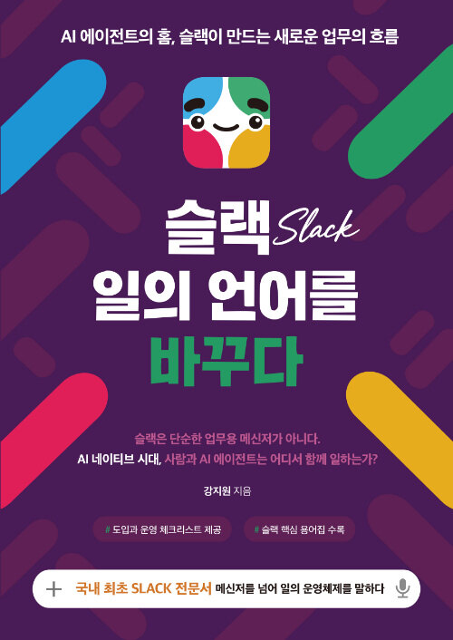
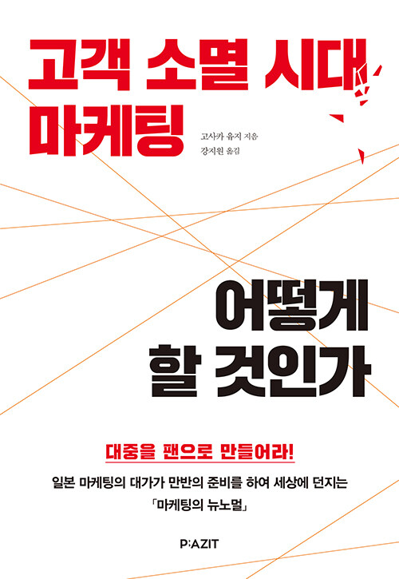

# Professional Development

고객의 도입·운영 과제를 이해하기 위해 SaaS 관리자 역량, AI 활용, 고객 가치와 업무 설계 학습을 이어가고 있습니다. 자격 취득 이력, 교육 수료·실습 배지, 출간 결과를 구분해 정리했습니다.

## SaaS Qualifications

본인이 제공한 경력자료와 LinkedIn 자격 이력을 기준으로 정리한 취득 이력입니다.

| 자격 | 취득월 | 비고 |
|---|---|---|
| Salesforce Certified Slack Administrator | 2025-06 | 취득 당시 명칭 기준 |
| Salesforce Certified Sales Representative | 2025-03 | 취득 당시 명칭 기준 |
| Salesforce Certified AI Associate | 2023-11 | 2026-02-02 자격 프로그램 종료 · 취득 이력 |
| Salesforce Certified Associate | 2023-11 | 취득 당시 명칭 기준 |
| Salesforce Certified Administrator | 2020-09 | 취득 당시 명칭 기준 |

Salesforce AI Associate는 [공식 종료 안내](https://partners.salesforce.com/pdx/s/pcnews/changes-coming-to-the-ai-associate-certification-MCEQK4WPR3YRA2DKCTPCCPCELCEU?language=ja)에 따라 취득 이력으로 표시했습니다. 개인별 현재 유지 상태는 별도 조회하지 않았습니다.

## AI Certificates — 2026

2026년 10월 8일 제공한 인증서 화면 기준입니다. 8개 모두 Valid Through는 2027년 10월 7일이며, Consultative Solutions Practitioner의 발행월은 LinkedIn 기재 기준 2026년 10월입니다.

| 인증서명 | 유효기한 |
|---|---|
| OpenAI Consultative Solutions Practitioner | 2027-10-07 |
| OpenAI Foundational Knowledge | 2027-10-07 |
| ChatGPT Deployment Practitioner | 2027-10-07 |
| Codex Solutions Practitioner | 2027-10-07 |
| ChatGPT Solutions Practitioner | 2027-10-07 |
| OpenAI Technical Practitioner | 2027-10-07 |
| OpenAI Cyber Solutions Practitioner | 2027-10-07 |
| API Deployment Practitioner | 2027-10-07 |

## Slack Learning & Badges

고객 서비스·가치 제안부터 보안·관리·자동화·플랫폼까지 이어지는 Slack 학습 이력입니다. Slack Administrator 자격은 위 자격 표에 별도로 기재했습니다.

Slack 배지·학습 이력 19개 보기

| 명칭 | 발행월 |
|---|---|
| Slack for Customer Service | 2024-12 |
| Slack Value | 2024-08 |
| Slack Canvas | 2024-06 |
| Slack Sales Elevate | 2024-01 |
| Block Kit | 2023-11 |
| Bolt | 2023-11 |
| Slack Platform | 2023-10 |
| Project Management | 2023-10 |
| Identity & Access Management | 2023-10 |
| Workflow Builder | 2023-10 |
| Data Protection | 2023-10 |
| App Governance | 2023-10 |
| Slack Analytics | 2023-10 |
| Roles & Permissions Management | 2023-10 |
| Channel Management | 2023-10 |
| Slack Connect | 2023-10 |
| Etiquette & Productivity | 2023-10 |
| Digital HQ | 2023-10 |
| Slack Basics | 2023-10 |

## Salesforce Training & Superbadges

| 유형 | 명칭 | 발행월 |
|---|---|---|
| 교육 수료 | Essentials for New Lightning Experience Administrators | 2025-03 |
| Superbadge / Unit | User Authentication Settings Superbadge Unit | 2022-09 |
| Super Set | Admin Super Set | 2022-09 |
| Superbadge / Unit | Lightning Experience Reports & Dashboards Specialist | 2022-09 |
| Superbadge / Unit | Business Administration Specialist | 2022-07 |
| Superbadge / Unit | User Access Troubleshooting Superbadge Unit | 2022-09 |

교육 수료와 Trailhead 실습 배지·Super Set 이력입니다. Super Set과 구성 배지는 각각 전문 자격증으로 합산하지 않습니다.

## AI Learning — 2026

OpenAI는 LinkedIn에 표시된 발급기관입니다. 발행월은 LinkedIn 기재, 일 단위 Validation 기간은 앞서 제공한 인증서 화면 기준입니다.

| 과정·인증서명 | 발행월 | Validation 시작 | 유효기간 종료 |
|---|---|---|---|
| Get Started with Codex | 2026-10 | 2026-10-05 | 2027-04-05 |
| Scope AI Solutions | 2026-10 | 2026-10-03 | 2027-04-03 |
| Agents and Workflows | 2026-10 | 2026-10-02 | 2027-04-02 |
| Applied AI Foundations | 2026-10 | 2026-10-02 | 2027-04-02 |
| AI Foundations | 2026-10 | 미표시 | 2027-04 |

기존 4개 과정의 Validation 표시는 PDT 기준이며 발급일과 구분합니다. AI Foundations와 Applied AI Foundations는 서로 다른 명칭과 식별번호로 기재된 항목입니다.

## Anthropic & Notion Learning

| 과정·Quiz | 표시 기관 | 발행월 |
|---|---|---|
| Claude Code in Action | Anthropic Claude | 2026-05 |
| Claude 101 | Anthropic Claude | 2026-04 |
| Notion Advanced Quiz | Notion | 2026-02 |
| Notion Workflows Quiz | Notion | 2026-02 |
| Notion Essentials Quiz | Notion | 2026-02 |

## Business, Analytics & Compliance Learning

비즈니스·분석·법률 관련 학습 이력 14개 보기

| 과정 | 표시 기관 | 발행월 |
|---|---|---|
| An Introduction to American Law (Upenn Law School) | Coursera | 2024-01 |
| Privacy Law and Data Protection (UPenn) | Coursera | 2023-05 |
| Regulatory Compliance 특화 과정 | Coursera | 2023-05 |
| Intro to International Marketing | Coursera | 2021-05 |
| Global Trends for Business and Society | University of Pennsylvania | 2021-04 |
| Design Thinking for Innovation | Coursera | 2020-06 |
| Accounting Analytics Wharton School | Coursera | 2020-06 |
| Data Visualization with Advanced Excel | Coursera | 2020-06 |
| Operations Analytics | Coursera | 2020-05 |
| Diversity and inclusion in the workplace | Coursera | 2020-05 |
| People Analytics by Wharton School Upenn | Coursera | 2020-05 |
| English for Career Development | Coursera | 2020-03 |
| Data-Driven Decision Making | Coursera | 2020-03 |
| AWS Fundamentals: Going Cloud-Native | Coursera | 2020-03 |

## Digital Foundations — 2020

기초 디지털 학습 배지입니다. 일 단위 발급일은 기존 배지 화면, Cloud Core의 월 단위 날짜는 LinkedIn 기재 기준입니다.

| 배지·학습 명칭 | 표시 기관 | 발급일·월 |
|---|---|---|
| Cloud Core | IBM | 2020-03 |
| Data Science Foundations - Level 1 | IBM | 2020-03-02 |
| Data Science Orientation | Coursera | 2020-03-02 |
| Cloud Essentials | IBM | 2020-03-05 |
| Big Data Foundations - Level 1 | IBM | 2020-03-10 |
| IBM Blockchain Essentials V2 | IBM | 2020-03-10 |
| Data Science Foundations - Level 2 (V2) | IBM | 2020-03-12 |
| Build Your Own Chatbot - Level 1 | IBM | 2020-03-16 |
| IBM Storage and Cloud Essentials | IBM | 2020-03-21 |

Cloud Core의 중복 기재는 한 항목으로 정리했습니다. 기존 화면의 Cloud Essentials와 동일 배지인지 확인되지 않아 두 명칭을 보존했으며, 별개 취득 건수로 합산하지 않습니다.

## Other Training & Activity History

교육·행사·활동 이력 보기

| 구분 | 명칭 | 표시 기관 | 기재 시점 |
|---|---|---|---|
| 행사 이력 | aws INNOVATE ONLINE CONFERENCE- AI/ML EDITION | Amazon Web Services (AWS) | 2020-02 |
| 교육 이력 | Regional Sales Training Program | Fujitsu | 2019-05 |
| 활동 기록 | Volunteer Project Manager | 고려대학교 | 2011-12 |

## Historical Language Test Results

과거 어학 성적 보기 — 2020년 4월 유효기간 종료

| 시험·등급 | 기관 | 발행월 | 만료월 |
|---|---|---|---|
| TOEIC Speaking Test (Level 6) | ETS | 2018-04 | 2020-04 |
| OPIc Japanese ADVANCED LOW | ACTFL | 2018-04 | 2020-04 |

현재 유효한 어학 성적으로 사용하지 않습니다.

## Speaking

2025년 발표자료의 발표자 표기와 경력기록을 대조한 대외 발표 이력입니다.

- **SW AI WEEK:** 오픈소스·Slack·AI를 산업과 대학의 업무 흐름에 연결하는 적용 방향 발표.
- **Salesforce 3S:** Slack 기반 협업과 AI 업무 활용을 주제로 발표.

고객별 교육과 웨비나 자료에서는 청중의 업무·운영 책임·질문에 맞춰 설명 수준을 조정했습니다. [역할별 교육 설계](work-samples/slack/role-based-enablement.md)

## Publication

### 『슬랙, 일의 언어를 바꾸다』

**강지원 저 · 틔움출판 · 2026.08.03 출간**

### 『고객 소멸 시대 마케팅 어떻게 할 것인가』

**고사카 유지 저 · 강지원 역 · 파지트 · 2022.01.12 출간**

일본어 원서 **『「顧客消滅」時代のマーケティング』** 번역 출판. [도서 정보](https://www.ypbooks.co.kr/books/202308239140273878)

[전체 포트폴리오](README.md)
