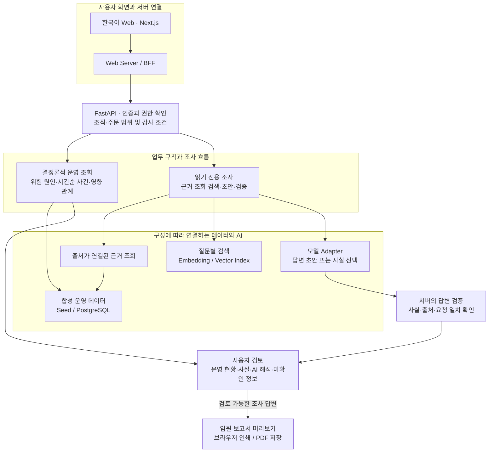
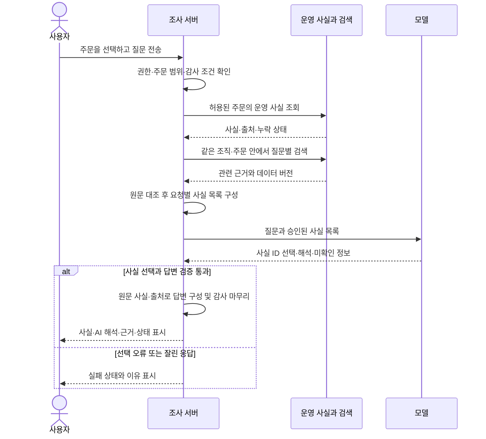

# SemiFlow — Architecture & Trust Boundaries

**합성 제조 데이터 기반 R&D / Sandbox · 읽기 전용 운영 조사**

SemiFlow는 운영 수치를 계산하는 기능, 근거를 검색하는 기능, AI가 설명하는 기능의 책임을 나눕니다. 사용자는 주문의 위험을 확인하고 근거를 조사한 뒤, 사실과 AI 해석을 검토해 보고서로 정리합니다.

*기준: 2026-10-07 「SemiFlow A–Z」에 정리된 구현·검증 기록. 코드 기준일은 2026-10-02입니다.*

## 1. 전체 구조

아래는 구현된 구성 요소의 호출·참조 관계입니다. 데이터·검색·모델 연결은 실행 구성을 통해 선택하며, 모든 연결이 기본 설정에서 켜져 있거나 현재 가동 중이라는 의미는 아닙니다.

| 계층 | 책임 | 사용자에게 중요한 의미 |
|---|---|---|
| Web / BFF | 한국어 화면과 서버 요청 연결, 로그인 세션 처리 | 화면에서 선택한 주문과 조사 결과를 연결 |
| 인증·권한·감사 | 사용자의 권한과 조직·주문 범위를 서버에서 확인 | 허용된 정보만 조회하고 조사 결정을 기록 |
| 운영 도메인 | 데이터와 정해진 규칙으로 위험·상태 계산 | 같은 입력으로 결과와 원인을 다시 확인 |
| 읽기 전용 조사 | 운영 사실, 질문별 근거 검색, 모델 호출과 검증 조율 | 업무 질문을 근거가 있는 설명으로 연결 |
| 데이터·검색·모델 Adapter | 업무 규칙과 특정 데이터·모델 구현 사이의 연결 | 기술 변경 시에도 업무 의미와 검증 기준 유지 |
| 답변·보고서 | 검증된 사실과 AI 해석을 구분해 전달 | 사용자가 근거를 확인하고 최종 판단 |

## 2. 근거 검색과 사실 선택의 흐름

다음은 **추가 생산·자재·출하 근거가 연결된 답변 경로**입니다. 기본 주문 근거만 사용하는 경로와 처리 방식이 같지는 않습니다.

권한이나 감사의 필수 조건을 충족하지 못하면 모델 호출 전 조사를 차단합니다. 검색이 실패한 경우에는 사용 불가 상태를 유지하며, 조회되지 않은 자료 전체를 대신 넣지 않습니다. 이 그림은 정상적으로 추가 근거를 얻은 이후의 사실 선택과 검증 분기를 보여 줍니다.

## 3. 신뢰를 위한 경계

- **서버가 접근 범위를 결정합니다.** 화면이나 모델이 제시한 조직·고객·주문 정보를 권한의 근거로 그대로 사용하지 않습니다. 검색 결과의 관련성이 높아도 접근 권한을 대신하지는 않습니다.
- **근거의 출처와 버전을 유지합니다.** 검색 결과를 해당 요청의 원문·조직·주문·데이터 버전과 대조합니다. 사실 선택 경로는 검증된 원문과 출처로 답변을 구성한 뒤 사용자에게 전달합니다.
- **AI 해석에는 사람의 검토가 필요합니다.** 사실 ID 검증이 자연어 해석의 모든 숫자나 인과관계까지 보장하지 않습니다. 확인된 사실, 분석 의견과 미확인 정보를 구분합니다.
- **현재 Agent는 읽기 전용입니다.** 검색·분석·초안·추천·제안이 범위입니다. 실제 주문 변경, 승인 생성, 메시지 전송과 자율 실행은 후속 범위입니다.
- **보고서는 검토 가능한 조사 결과를 재사용합니다.** 보고서 생성만을 위한 추가 모델 호출은 하지 않습니다. 주문·질문·출처가 바뀌면 이전 결과의 출력 가능 여부를 다시 확인합니다. PDF는 브라우저 인쇄 기능이며 서버에서 파일을 저장·배포하는 기능은 아닙니다.

## 4. 구현·선택 연결·후속 범위

| 구분 | 현재 범위 | 확인할 조건 |
|---|---|---|
| 구현과 자동검증 기록 | 운영 도메인, 한국어 Web, 권한·근거·답변 검증, 읽기 전용 조사, 후속 질문 | 합성 데이터와 검증 환경의 범위로 해석 |
| 선택적으로 연결하는 경로 | PostgreSQL 운영 사실, 질문별 검색 인덱스, 로컬 모델 Adapter, 합성 ERP/SCM 조회 | 명시적 구성과 데이터·모델의 버전 확인 필요. 코드 존재와 실제 활성화는 별개 |
| 보고서와 PDF | 미리보기·브라우저 인쇄 구현, 테스트용 데이터의 인쇄 검토 기록 | 최신 실제 AI 답변부터 보고서까지의 전체 동작은 별도 확인 |
| 실제 운영 | 일부 Sandbox 배포와 Demo 실행 기록 | 현재 가동 상태·가용성·장애 복구·운영 인수는 추가 확인 |
| 향후 업무 실행 | 사람의 승인, 중복 실행 방지, 실행 직전 상태 확인, 실행 후 재조회와 복구 기준 | 설계·확장 조건이며 실제 외부 시스템 실행 완료가 아님 |

기본 모델 경로는 검증용 모의 응답이며 외부 LLM 호출은 기본 비활성입니다. 로컬 모델을 사용하는 경로는 별도 구성이 필요합니다. 인증·권한 코드가 있다는 사실도 모든 환경에서 보안 설정이 활성화되었거나 상용 고객 간 데이터 격리가 검증되었다는 의미는 아닙니다.

다음 운영 확인은 **주문 선택 → 질문 → 근거가 있는 답변 → 후속 질문 → 보고서** 전체 흐름과 함께 데이터 누락·모델 실패·중단·복구 상황을 다루어야 합니다. 실제 고객의 처리량·업무 절감 효과나 상용 운영 SLA는 이 구조만으로 입증되지 않습니다.

## Source Basis

「SemiFlow A–Z」의 E(아키텍처), J(권한·감사), K–P(데이터·검색·조사·모델), Q–R(답변·보고서), W–Z(검증·현재 범위·운영 인수)를 공개용으로 재구성했습니다. 이 문서 작성 과정에서 실행 환경을 새로 검증하지 않았습니다.

[제품 판단 상세 사례](semiflow-deep-dive.md) · [요약 사례](../case-studies/06-ai-assisted-control-tower.md) · [공개 프로젝트](README.md)
