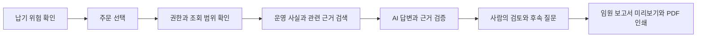

# SemiFlow — Product Decisions & AI Delivery

**AI-assisted 제품 기획·검증 사례 · 합성 제조 데이터 기반 R&D / Sandbox**

SemiFlow는 주문·생산·자재·출하 정보를 연결해 납기 위험을 조사하고, AI가 근거를 정리해 사람이 판단하도록 돕는 운영 관제 프로젝트입니다. 업무 문제를 사용 흐름과 검증 기준으로 바꾸고, 데이터·모델·권한·운영 조건을 조율하는 과정을 설명합니다.

*작성 기준: 2026-10-07 프로젝트 A–Z 해설에 정리된 구현·검증 기록. 해당 기록이 확인한 코드 기준은 2026-10-02입니다.*

[전체 아키텍처와 근거 검증 순서도](semiflow-architecture.md)에서 구성 요소의 책임과 연결을 볼 수 있습니다.

| 항목 | 범위 |
|---|---|
| 다루는 문제 | 여러 시스템에 분산된 제조 운영 정보와 납기 위험의 원인 조사 |
| 본인 역할 | 제품 Owner: 문제·요구사항·우선순위·수용 기준 정의, AI-assisted 구현 요청과 결과 검토 |
| 업무 흐름 | 위험 확인 → 근거 조사 → AI 설명 → 사람의 검토 → 임원 보고서 |
| 데이터 자산 | 36개월·36,000건의 합성 주문과 연결된 생산·자재·입고·출하 데이터 |
| 현재 단계 | 읽기 전용 조사와 보고를 중심으로 한 Sandbox. 실제 고객의 유료 운영 성과는 미측정 |

## 1. 기능보다 먼저 정의한 업무 문제

제조 운영에서는 생산, 자재, 출하와 고객 납기 정보가 서로 다른 시스템에 있습니다. 주문이 늦어질 가능성이 보이면 담당자는 여러 자료를 대조하고, 원인과 영향을 정리해 다음 행동을 결정해야 합니다.

| 사용자 | 필요한 판단 | 제품에서 다룬 정보 |
|---|---|---|
| 운영 담당자 | 어떤 주문부터 확인할 것인가 | 위험 분포, 우선 확인할 주문, 사이트별 현황 |
| 생산·자재 담당자 | 어느 공정·자재가 납기에 영향을 주는가 | 진행 상태, 부족량, 입고 계획, 시간순 사건과 영향 관계 |
| 출하·물류 담당자 | 출하 준비와 운송에서 무엇이 지연되는가 | 출하·물류 상태와 관측 근거 |
| 경영진 | 현재 상황·영향·대응을 어떻게 판단할 것인가 | 확인된 사실, AI 분석 의견, 대응 제안과 근거 |

이 사용자 구분을 기준으로 조회 화면, 조사 질문, 보고서 구성을 정리했습니다. 역할별 전체 운영 권한 체계의 완성을 의미하지는 않습니다.

## 2. 업무 흐름을 확인 가능한 결과로 연결



그림은 구현된 기능을 잇는 제품 흐름입니다. 최신 실행 환경에서 이 전 과정을 다시 검증한 결과와는 구분합니다.

예를 들어 사용자가 “어떤 자재가 부족하고 입고 계획은 어떻게 되나요?”라고 묻는 상황을 설계했습니다. 시스템은 해당 사용자가 볼 수 있는 주문의 근거를 찾고, 확인된 자재·입고 정보와 AI의 해석, 아직 확인할 수 없는 정보를 나누어 보여줍니다. 이 문장의 예시는 사용자 시나리오이며 실제 모델 실행 결과를 인용한 것은 아닙니다.

## 3. AI 도입에서 내린 설계 판단

### 운영 사실과 AI 해석의 책임을 구분

납기 위험 점수와 운영 수치는 데이터와 명시적인 규칙으로 계산합니다. AI는 허용된 근거를 찾아 설명과 대응 초안을 작성합니다. 원인을 다시 확인할 수 있는 계산과 자연어 해석을 구분한 결정입니다.

현재 위험 계산은 합성 시나리오용 규칙이며 실제 고객 데이터로 보정한 예측 모델이나 지연 확률은 아닙니다.

### 데이터가 풍부해도 의미와 출처를 유지

36개월·36,000건의 합성 주문에 생산·자재·입고·출하 데이터를 연결했습니다. 입고 계획과 입고 실적, 주문별 할당량과 전체 가용 재고, 관측값과 미기록 값을 구분합니다. 기록이 없는 날짜를 완료일로 바꾸거나 조회 실패를 0으로 표시하지 않는 것이 기준입니다.

이 데이터 규모는 합성 검증 자산의 범위입니다. 실제 고객 주문량이나 모든 화면의 동시 조회·처리 성능을 의미하지 않습니다.

### 질문에 필요한 근거를 권한 범위 안에서 검색

질문에 따라 주문·고객, 생산, 자재, 입고, 출하·물류 중 관련 근거를 선택하는 검색 경로를 구성했습니다. 검색한 근거가 같은 조직·주문과 데이터 버전에 속하는지 검증하고, 확인된 원문을 답변에 사용합니다.

인증·권한 판단과 검색 결과의 관련성 판단은 서로 다른 책임입니다. 검색이 실패하면 실패 상태를 드러내며, 조회되지 않은 자료를 임의로 채워 넣지 않습니다.

### 답변 생성 모델과 검색 모델을 별도 선택

문장을 만드는 모델과 관련 근거를 찾는 Embedding 모델은 역할과 평가 기준이 다릅니다. 특정 모델·도구와 업무 규칙 사이에 연결 계층을 두어 교체 가능한 구조를 지향했습니다.

로컬 모델과 검색 연결 코드가 있으며, 장기 모델 후보·실제 설치·현재 가동 상태는 별도의 확인 대상입니다. Demo에 사용한 모델이 자동으로 상용 운영 기준이 되는 것은 아닙니다.

### AI가 선택한 사실을 서버에서 다시 검증

추가 업무 근거를 사용하는 답변 경로에서는 요청에 연결된 사실 목록을 만들고, 모델이 그중 사용할 사실을 선택하도록 했습니다. 서버는 선택이 유효한지 확인한 뒤 원문 사실과 출처를 사용해 답변을 구성합니다. 다른 요청의 사실이나 잘린 응답은 정상 답변으로 제공하지 않습니다.

자연어 해석에는 오류 가능성이 남습니다. 사실 선택 검증과 사람의 최종 검토를 함께 유지합니다.

### 읽기 전용 조사부터 범위를 설정

현재 Agent의 범위는 검색·분석·초안·추천·제안입니다. 권한·주문 범위나 감사 기록의 필수 조건을 충족하지 못하면 조사를 차단합니다.

외부 주문 변경이나 자율 실행은 후속 범위입니다. 실제 변경으로 확장하려면 사람의 승인, 중복 실행 방지, 실행 직전 상태 확인, 실행 후 결과 재조회와 복구 기준이 필요합니다.

### 조사 답변을 의사결정 자료로 재사용

임원 보고서는 기존 조사 답변의 사실과 근거를 활용해 핵심 요약·현황·위험·대응·근거로 구성합니다. 보고서 생성만을 위한 추가 모델 호출은 하지 않습니다. 주문이나 조사 결과가 바뀌면 오래된 결과의 출력도 제한합니다.

보고서 미리보기와 브라우저 PDF 인쇄가 구현되어 있고 테스트용 데이터의 인쇄 검토 기록이 있습니다. 최신 실제 AI 답변에서 보고서까지 이어지는 전체 검증은 별도 과제로 남아 있습니다.

## 4. 구현과 검수·운영을 연결한 관리 방식

본인 역할은 제품 요구와 작업 범위를 정하고, 구현 결과를 수용 기준과 검증 기록으로 판단하는 데 있습니다. 코드 구현은 AI 도구를 활용해 진행했습니다.

프로젝트에서는 다음과 같이 변경을 관리합니다.

```text
문제·범위·수용 기준 정의
→ 범위별 구현과 검증
→ 독립 검토와 자동검증
→ 검토한 변경을 기준으로 통합
→ 통합 이후 검증
→ 실행 환경과 운영 준비 상태 확인
```

구현, 독립 검토, 변경 통합과 실제 운영 작업을 구분했습니다. 이를 통해 기능의 존재, 검증된 동작과 운영 준비 상태를 각각 설명할 수 있도록 했습니다.

## 5. 무엇까지 확인했는가

| 구분 | 기록으로 확인한 범위 | 추가로 확인할 범위 |
|---|---|---|
| 업무 계산 | 위험 계산·시간순 사건·영향 관계의 구현과 자동검증 | 실제 고객 데이터의 적합성과 업무 기준 |
| 데이터·검색 | 합성 데이터, 저장·조회, 범위 제한 검색과 정합성 검증 | 실제 데이터 연결, 실행 환경의 최신 인덱스 상태 |
| AI 조사 | 권한·근거·출력 검증, 후속 질문 구현 및 테스트 | 현재 모델 가동과 최신 응답 품질 |
| Web·보고서 | 한국어 화면, 미리보기·인쇄 구현과 테스트용 출력 검토 | 최신 실제 답변에서 보고서까지의 전체 동작 |
| 운영 | 일부 Sandbox 배포·실제 Demo 실행 기록 | 현재 가용성, 장애·복구, 운영 인수 기준 |

자동검증은 업무 계산, 인증·권한·조직 간 분리, 검색 근거의 일치, 모델 출력, 화면 상태와 데이터 적재를 다룹니다. 기록의 기준 시점에서 Backend·Web·PostgreSQL 통합 검증 성공을 확인했으며, 테스트 개수를 기능 완성률이나 고객 성과로 환산하지 않습니다.

## 6. Enterprise Customer Success와 연결되는 역량

| 고객 도입 업무 | 이 프로젝트에서 설명할 수 있는 경험 |
|---|---|
| 고객 목표와 다음 단계 정의 | 사용자별 업무 질문을 기능 범위와 수용 기준으로 구체화 |
| 기술팀과 실행 범위 조율 | 데이터·검색·모델·권한·화면의 역할과 확인할 조건 정리 |
| AI 도입 리스크 설명 | 근거 누락, 오래된 데이터, 권한 부족, 잘린 답변과 오류 상황을 명시 |
| 경영진 커뮤니케이션 | 조사 결과를 사실·해석·대응 제안이 구분된 보고서로 구성 |
| 도입·운영 전환 판단 | 구현·자동검증·배포·실제 가동·업무 수용을 나누어 판단 |

이는 AI 도입을 설계하고 검증하는 역량의 근거입니다. 고객 갱신·매출·만족도 성과는 별도의 고객 프로젝트 사례에서 설명합니다.

## 7. 실제 고객 PoC로 확장할 때의 확인 순서

다음은 후속 검증 계획이며 이미 수행한 고객 실적은 아닙니다.

1. 고객이 판단해야 할 업무와 성공 기준을 정합니다.
2. 사용할 데이터, 접근 권한과 허용할 AI 동작을 합의합니다.
3. 정상 사례와 데이터 누락·권한 부족·모델 실패 사례를 함께 검증합니다.
4. 주문 선택부터 질문·후속 질문·보고서까지 실제 실행 환경에서 확인합니다.
5. 사용자 피드백, 운영 담당자, 장애 대응·복구 기준을 바탕으로 다음 도입 범위를 결정합니다.

## Source Basis

비공개 프로젝트 해설 **「SemiFlow A–Z」(2026-10-07)**의 A–E(제품·사용자·원칙), G·J–P(계산·권한·데이터·검색·모델), Q–R(대화·보고서), W–Z(검증·협업·완성 범위·운영 인수)를 공개 포트폴리오 목적에 맞게 재구성했습니다. 이 페이지 작성 과정에서 실행 환경을 새로 점검하거나 고객 효과를 측정하지 않았습니다.

[요약 사례](../case-studies/06-ai-assisted-control-tower.md) · [공개 프로젝트](README.md) · [전체 포트폴리오](../README.md)
