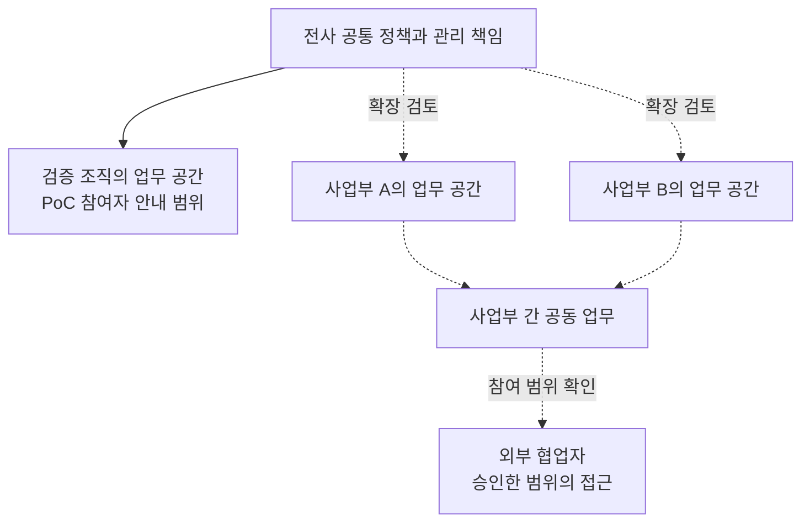

# Slack Enterprise — 조직 구조를 운영·권한 설계로 연결

**산출물:** 유통기업 AX 조직의 PoC 참여자 안내·확산 구상을 공개용으로 재구성한 설계 샘플

고객의 사업부 구조를 협업 공간과 관리 책임으로 옮겨 설명했습니다. PoC 참여자가 지금 사용할 공간과 역할을 이해하도록 안내하고, 이후 사업부별 도입과 전사 확장을 검토할 수 있는 구조를 함께 제시했습니다.

원본에는 강지원이 담당 컨설턴트로 명시되어 있습니다. 아래 그림은 당시 안내자료를 익명화·단순화한 것으로, 확장안까지 모두 구축했다는 의미는 아닙니다.

## 1. 파일럿과 확장안을 한 구조에서 설명

실선은 PoC 안내에서 다룬 관리 관계를, 점선은 이후 확장 구상을 나타냅니다. 사업부 개수와 실제 채널명은 공개용으로 단순화했습니다. 기술 시스템 간 데이터 흐름도가 아닌 **협업 공간과 운영 책임의 개념도**입니다.

## 2. 조직별 자율성과 공통 관리의 경계를 나누기

| 설계 대상 | 안내자료에서 다룬 판단 | 고객이 이해해야 할 책임 |
|---|---|---|
| 전사 공통 영역 | 조직 정책과 전체 계정·인증의 관리 | 전사 관리자가 결정할 기준 |
| 사업부·검증 조직 | 해당 업무 공간의 채널·구성원·앱 운영 | 현장 관리자가 맡을 일과 상위 정책의 관계 |
| 일반 참여자 | 업무 대화, 자료 공유, 자동화와 AI 활용 검증 | 참여자가 직접 시험할 범위 |
| 외부 협업자 | 참여할 업무와 접근할 공간의 제한 | 초대 목적과 허용 범위의 확인 |
| 전문 관리 역할 | 채널·사용자·보안·분석 등 관리 업무의 분담 | 필요한 관리 업무에 맞춘 역할 배분 |

사업부의 협업 공간과 전사 정책을 구분하고, 모든 관리 업무를 한 사람에게 집중하지 않는 방향을 설명했습니다. 구체적인 권한은 고객 설정과 도입 조건에서 확인할 항목으로 남깁니다.

## 3. PoC에서 다음 도입 단계로 이어지는 설명

원본의 확산안은 검증 조직의 PoC, 사업부별 도입, 전사·외부 협업 확장으로 구성돼 있습니다. PoC에서는 커뮤니케이션, AI 활용과 업무 자동화를 검토하고, 이후 단계에는 독립적인 사업부 운영과 공통 정책, 조직 간 협업을 제시했습니다.

각 단계는 서로 다른 질문에 답해야 합니다.

- **PoC:** 참여자가 어떤 업무를 시험하고 어떤 권한으로 사용할 것인가?
- **사업부 도입:** 사업부가 운영할 범위와 전사에서 관리할 기준은 무엇인가?
- **전사 확장:** 조직 간 공유와 외부 협업을 어떤 책임·접근 범위로 운영할 것인가?

이는 안내자료의 설계 논리를 정리한 질문입니다. 원본의 단계별 예상 인원은 도입 실적에서 제외했으며, 확장 계약이나 전사 운영 완료를 주장하지 않습니다.

## 근거와 기여 범위

2026년 유통기업 AX PoC의 역할·권한 안내와 Enterprise 구조 설명 자료를 사용했습니다. 확인되는 기여는 고객 조직을 협업 구조로 설명하고, 참여자 역할과 다음 도입 단계를 문서화한 것입니다. 개인 단독 아키텍처 설계, 모든 권한 설정의 구현·검수 또는 현재 제품 사양을 입증하는 자료는 아닙니다.

[도입 전 기술 확인](technical-readiness.md) · [수행 관리와 운영 설계](delivery-and-governance.md) · [Slack 사업·고객 사례](README.md)
